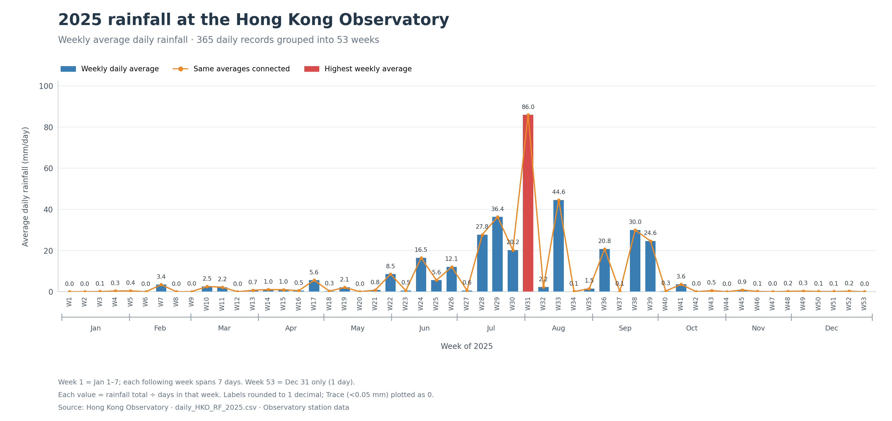

# The phenomenon

## The phenomenon
This project looks at how rainfall changed throughout 2025 at the Hong Kong Observatory. I chose rainfall because I wanted to see when rain was concentrated during the year and how different the wetter and drier periods were. The first version showed every day separately, but the bars were too crowded. I changed the chart to weekly averages to make the overall pattern easier to read.

## The source
The data comes from the Hong Kong Observatory's 2025 daily total rainfall CSV. The original file is saved unchanged as data/daily_HKO_RF_2025.csv.

It contains 365 daily records, plus headings and explanatory notes. Each record includes the year, month, day, daily rainfall in millimetres, and a data completeness marker. These measurements represent the Observatory station, rather than all of Hong Kong. Trace means rainfall below 0.05 mm; the chart treats it as zero.

Source: https://data.weather.gov.hk/weatherAPI/cis/csvfile/HKO/2025/daily_HKO_RF_2025.csv

## What the picture shows
The chart shows average daily rainfall for each seven-day period starting on January 1, with a month timeline below the week labels; the final period contains only December 31 and uses that day's value. Blue bars and an orange line show the same averages, labels are rounded to one decimal place, and the highest average is highlighted in red. Rainfall is concentrated around July to September, but averaging hides individual daily peaks, and this chart does not show differences between locations in Hong Kong.

## Run it
From the project folder, run:

uv run fetch.py
uv run plot.py

